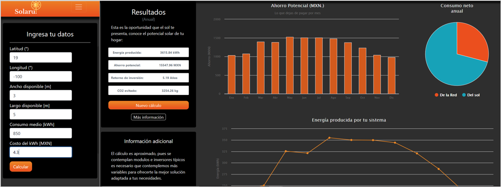

# Solaru App
Solaru App es una aplicación web escrita en Python, pensada para calcular un sistema fotovoltáico diseñado específicamente a las condiciones de tu hogar ☀.
Para ello solo necesitas ingresas tu ubicación (latitud y longitud), el espacio disponible, tu consumo promedio de energía y el costo del kWh para realizar el análisis económico.

## Tecnologías
| Backend  |  Frontend  |
| ------------ | ------------ |
|  [Flask](https://flask.palletsprojects.com/en/1.1.x/ "Flask")  |  HTML  |
|  [PvLib](https://pvlib-python.readthedocs.io/en/stable/ "PvLib") |  CSS  |
|  [PVGIS](https://ec.europa.eu/jrc/en/PVGIS/releases/pvgis51 "PVGIS") |  Bootstrap  |

## Pruébala ahora
La aplicación la puedes consultar [aquí](http://solaru.appspot.com "aquí") ya!

## Preview

### Notas
Si el tema te gusta y quieres contribuir para convertir este proyecto en algo más grande, clonale y ponte en contacto conmigo 😎.